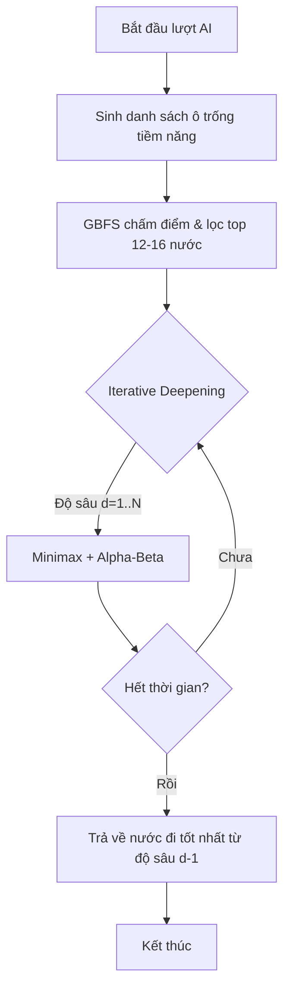

# Chi Tiết Thuật Toán Trí Tuệ Nhân Tạo

Tài liệu này giải thích chi tiết cơ chế hoạt động của engine AI trong dự án Cờ Caro, bao gồm các thuật toán tìm kiếm, kỹ thuật tối ưu hóa và hàm đánh giá chiến thuật.

## 1. Tổng quan chiến lược tìm kiếm
AI không chỉ sử dụng một thuật toán duy nhất mà kết hợp một chuỗi các kỹ thuật (Pipeline) để đưa ra quyết định:
1. **Lọc ứng viên (Candidate Filtering)**: Thu hẹp phạm vi tìm kiếm.
2. **Sắp xếp nước đi (Move Ordering - GBFS)**: Ưu tiên các nước hứa hẹn nhất.
3. **Duyệt sâu dần (Iterative Deepening)**: Quản lý thời gian linh hoạt.
4. **Minimax + Alpha-Beta**: Tìm kiếm nước đi tối ưu trong không gian trạng thái.

---

## 2. Các thành phần thuật toán cốt lõi

### 2.1. Greedy Best-First Search (GBFS) - Tầng Sàng Lọc
Thay vì đưa toàn bộ các ô trống trên bàn cờ vào Minimax (gây bùng nổ số lượng nhánh), AI sử dụng GBFS để chấm điểm nhanh từng ô:
- **Nguyên lý**: Chỉ xét các ô trống nằm trong bán kính 1 ô xung quanh các quân cờ đã đánh.
- **Tiêu chí chấm điểm**:
    - Ưu tiên tuyệt đối nước đi thắng ngay.
    - Cộng thưởng lớn cho nước đi chặn được thế thắng ngay của đối thủ.
    - Sử dụng hàm Heuristic cục bộ để xếp hạng.
- **Kết quả**: Chỉ giữ lại top `max_candidates` (ví dụ: 12-16 nước) tốt nhất để đưa vào duyệt sâu.

### 2.2. Minimax & Alpha-Beta Pruning
Đây là "bộ não" quyết định chiến lược dài hạn:
- **Minimax**: Giả định cả AI và người chơi đều đánh tối ưu. AI cố gắng cực đại hóa điểm số (MAX), người chơi cố gắng cực tiểu hóa điểm số của AI (MIN).
- **Alpha-Beta Pruning**: Kỹ thuật cắt tỉa các nhánh chắc chắn không mang lại kết quả tốt hơn phương án hiện tại. Điều này giúp AI có thể duyệt sâu hơn từ 2-3 lớp so với Minimax thuần túy.

### 2.3. Iterative Deepening (Duyệt sâu dần)
Để kiểm soát thời gian phản hồi (ví dụ: tối đa 2 giây), AI không nhảy thẳng vào độ sâu mục tiêu:
1. Bắt đầu tìm kiếm ở độ sâu 1, sau đó là 2, 3...
2. Nếu thời gian vẫn còn, AI tiếp tục lên độ sâu cao hơn.
3. Nếu hết thời gian (Timeout), AI dừng lại và trả về nước đi tốt nhất tìm được ở độ sâu hoàn thành gần nhất.

---

## 3. Hàm đánh giá Heuristic (`heuristics.py`)

Hàm đánh giá là linh hồn của AI, giúp nó "cảm nhận" được thế trận mà không cần đánh đến cuối ván.

### 3.1. Chấm điểm theo chuỗi (Run Scoring)
AI quét bàn cờ theo 4 hướng (ngang, dọc, 2 đường chéo) để tìm các chuỗi quân liên tiếp:
- **Chiều dài**: Chuỗi càng dài điểm càng cao (tăng theo hàm mũ).
- **Số đầu mở (Open Ends)**: 
    - **2 đầu mở (Open-ended)**: Cực kỳ nguy hiểm. Ví dụ: "Open Four" (4 quân 2 đầu mở) là thế thắng chắc chắn.
    - **1 đầu mở**: Giá trị trung bình.
    - **Bị chặn 2 đầu**: Giá trị rất thấp.
- **Trừng phạt đối thủ**: Điểm trừ cho chuỗi của người chơi thường lớn hơn điểm cộng cho chuỗi của AI (hệ số ~1.2) để AI chơi thiên về phòng thủ chủ động.

### 3.2. Ưu tiên khu vực (Center Bias)
Các quân cờ ở gần trung tâm bàn cờ được cộng điểm thưởng nhỏ. Điều này giúp AI chiếm lĩnh không gian tốt hơn trong giai đoạn khai cuộc thay vì đánh tản mát ở biên.

---

## 4. Kỹ thuật tối ưu hóa nâng cao

### 4.1. Bảng chuyển vị (Transposition Table)
Sử dụng một Dictionary để lưu trữ kết quả của các trạng thái bàn cờ đã tính toán:
- Nếu gặp lại một thế cờ cũ (do thứ tự đánh khác nhau nhưng dẫn tới cùng một hình cờ), AI lấy kết quả từ bộ nhớ thay vì tính lại từ đầu.

### 4.2. Quản lý bộ nhớ đệm (Cache)
AI lưu trữ nước đi tốt nhất của các trạng thái đã gặp vào `STATE_BEST_MOVE_CACHE` dựa trên:
- Hình ảnh bàn cờ (Serialized string).
- Độ sâu tìm kiếm.
- Giới hạn thời gian.

---

## 5. Tóm tắt luồng xử lý

