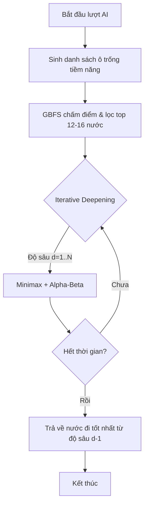
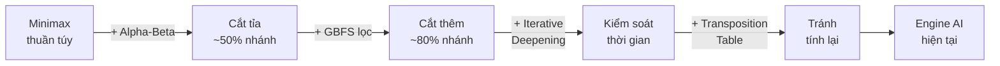

# Chi Tiết Thuật Toán Trí Tuệ Nhân Tạo

Tài liệu này giải thích chi tiết cơ chế hoạt động của engine AI trong dự án Cờ Caro, bao gồm các thuật toán tìm kiếm, kỹ thuật tối ưu hóa và hàm đánh giá chiến thuật.

## 1. Tổng quan chiến lược tìm kiếm
AI không chỉ sử dụng một thuật toán duy nhất mà kết hợp một chuỗi các kỹ thuật (Pipeline) để đưa ra quyết định:
1. **Lọc ứng viên (Candidate Filtering)**: Thu hẹp phạm vi tìm kiếm.
2. **Sắp xếp nước đi (Move Ordering - GBFS)**: Ưu tiên các nước hứa hẹn nhất.
3. **Duyệt sâu dần (Iterative Deepening)**: Quản lý thời gian linh hoạt.
4. **Minimax + Alpha-Beta**: Tìm kiếm nước đi tối ưu trong không gian trạng thái.

---

## 2. Các thành phần thuật toán cốt lõi

### 2.1. Greedy Best-First Search (GBFS) - Tầng Sàng Lọc
Thay vì đưa toàn bộ các ô trống trên bàn cờ vào Minimax (gây bùng nổ số lượng nhánh), AI sử dụng GBFS để chấm điểm nhanh từng ô:
- **Nguyên lý**: Chỉ xét các ô trống nằm trong bán kính 1 ô xung quanh các quân cờ đã đánh.
- **Tiêu chí chấm điểm**:
    - Ưu tiên tuyệt đối nước đi thắng ngay.
    - Cộng thưởng lớn cho nước đi chặn được thế thắng ngay của đối thủ.
    - Sử dụng hàm Heuristic cục bộ để xếp hạng.
- **Kết quả**: Chỉ giữ lại top `max_candidates` (ví dụ: 12-16 nước) tốt nhất để đưa vào duyệt sâu.

### 2.2. Minimax & Alpha-Beta Pruning
Đây là "bộ não" quyết định chiến lược dài hạn:
- **Minimax**: Giả định cả AI và người chơi đều đánh tối ưu. AI cố gắng cực đại hóa điểm số (MAX), người chơi cố gắng cực tiểu hóa điểm số của AI (MIN).
- **Alpha-Beta Pruning**: Kỹ thuật cắt tỉa các nhánh chắc chắn không mang lại kết quả tốt hơn phương án hiện tại. Điều này giúp AI có thể duyệt sâu hơn từ 2-3 lớp so với Minimax thuần túy.

### 2.3. Iterative Deepening (Duyệt sâu dần)
Để kiểm soát thời gian phản hồi (ví dụ: tối đa 2 giây), AI không nhảy thẳng vào độ sâu mục tiêu:
1. Bắt đầu tìm kiếm ở độ sâu 1, sau đó là 2, 3...
2. Nếu thời gian vẫn còn, AI tiếp tục lên độ sâu cao hơn.
3. Nếu hết thời gian (Timeout), AI dừng lại và trả về nước đi tốt nhất tìm được ở độ sâu hoàn thành gần nhất.

---

## 3. Hàm đánh giá Heuristic (`heuristics.py`)

Hàm đánh giá là linh hồn của AI, giúp nó "cảm nhận" được thế trận mà không cần đánh đến cuối ván.

### 3.1. Chấm điểm theo chuỗi (Run Scoring)
AI quét bàn cờ theo 4 hướng (ngang, dọc, 2 đường chéo) để tìm các chuỗi quân liên tiếp:
- **Chiều dài**: Chuỗi càng dài điểm càng cao (tăng theo hàm mũ).
- **Số đầu mở (Open Ends)**: 
    - **2 đầu mở (Open-ended)**: Cực kỳ nguy hiểm. Ví dụ: "Open Four" (4 quân 2 đầu mở) là thế thắng chắc chắn.
    - **1 đầu mở**: Giá trị trung bình.
    - **Bị chặn 2 đầu**: Giá trị rất thấp.
- **Trừng phạt đối thủ**: Điểm trừ cho chuỗi của người chơi thường lớn hơn điểm cộng cho chuỗi của AI (hệ số ~1.2) để AI chơi thiên về phòng thủ chủ động.

### 3.2. Ưu tiên khu vực (Center Bias)
Các quân cờ ở gần trung tâm bàn cờ được cộng điểm thưởng nhỏ. Điều này giúp AI chiếm lĩnh không gian tốt hơn trong giai đoạn khai cuộc thay vì đánh tản mát ở biên.

---

## 4. Kỹ thuật tối ưu hóa nâng cao

### 4.1. Bảng chuyển vị (Transposition Table)
Sử dụng một Dictionary để lưu trữ kết quả của các trạng thái bàn cờ đã tính toán:
- Nếu gặp lại một thế cờ cũ (do thứ tự đánh khác nhau nhưng dẫn tới cùng một hình cờ), AI lấy kết quả từ bộ nhớ thay vì tính lại từ đầu.

### 4.2. Quản lý bộ nhớ đệm (Cache)
AI lưu trữ nước đi tốt nhất của các trạng thái đã gặp vào `STATE_BEST_MOVE_CACHE` dựa trên:
- Hình ảnh bàn cờ (Serialized string).
- Độ sâu tìm kiếm.
- Giới hạn thời gian.

---

## 5. Tóm tắt luồng xử lý


---

## 6. Giải thích chi tiết từng bước (Step-by-Step)

---

### Bước 1: Định nghĩa lớp CaroGame — Nền tảng của toàn bộ hệ thống

Mọi thuật toán AI đều hoạt động xoay quanh lớp `CaroGame` trong `game.py`. Đây là "bàn cờ số" chứa toàn bộ trạng thái trò chơi:

```python
# game.py
class CaroGame:
    def __init__(self, size: int = 10, win_len: int = 5) -> None:
        self.size = size        # Kích thước bàn cờ (mặc định 10x10)
        self.win_len = win_len  # Số quân liên tiếp để thắng (mặc định 5)
        self.board: List[List[str]] = [
            [EMPTY for _ in range(size)] for _ in range(size)
        ]
        # EMPTY = "." — ký hiệu ô trống trong constants.py
```

Bàn cờ được biểu diễn là một **ma trận 2D** chuỗi ký tự:
- `"."` → ô trống
- `"X"` → quân AI
- `"O"` → quân người chơi

**Ví dụ minh họa** — bàn cờ 5x5 sau 3 nước đi:
```
. . . . .
. X . . .
. . O . .
. . . X .
. . . . .
```

---

### Bước 2: Các phương thức quản lý trạng thái bàn cờ

#### 2.1. `is_valid_move` — Kiểm tra nước đi hợp lệ

```python
def is_valid_move(self, move: Move) -> bool:
    return (
        0 <= move.row < self.size       # Không vượt biên trên/dưới
        and 0 <= move.col < self.size   # Không vượt biên trái/phải
        and self.board[move.row][move.col] == EMPTY  # Ô phải trống
    )
```

Hàm trả về `True` chỉ khi **cả 3 điều kiện** đều thỏa mãn. Nếu AI hoặc người chơi cố đánh vào ô đã có quân hoặc ngoài biên, nước đi bị từ chối.

#### 2.2. `make_move` và `undo_move` — Đánh và hoàn tác

```python
def make_move(self, move: Move, player: str) -> None:
    self.board[move.row][move.col] = player  # Đặt quân "X" hoặc "O"

def undo_move(self, move: Move) -> None:
    self.board[move.row][move.col] = EMPTY   # Xóa quân, trả về "."
```

> [!IMPORTANT]
> `undo_move` là **cơ chế cốt lõi** cho phép Minimax thử một nước đi, đánh giá kết quả, rồi **hoàn tác** để thử nước khác — tất cả trên cùng một đối tượng bàn cờ mà không cần sao chép. Điều này tiết kiệm bộ nhớ rất lớn.

**Ví dụ quy trình thử nước đi trong Minimax:**
```python
game.make_move(move, "X")   # Thử đặt quân X tại (3, 4)
score = minimax(game, ...)  # Đánh giá kết quả từ nước đi này
game.undo_move(move)        # Hoàn tác, bàn cờ trở về trạng thái ban đầu
```

#### 2.3. `check_winner` — Xác định người thắng

Đây là phương thức tốn tài nguyên nhất nếu quét toàn bàn. Dự án tối ưu bằng cách **chỉ kiểm tra xung quanh nước đi cuối cùng** (`last_move`):

```python
def check_winner(self, last_move: Optional[Move] = None) -> Optional[str]:
    if last_move is not None:
        player = self.board[last_move.row][last_move.col]
        # Chỉ kiểm tra 4 hướng từ ô vừa đánh
        if self._is_winning_position(last_move.row, last_move.col, player):
            return player
        return None
    # Fallback: quét toàn bàn (dùng khi không có last_move)
    for r in range(self.size):
        for c in range(self.size):
            player = self.board[r][c]
            if player != EMPTY and self._is_winning_position(r, c, player):
                return player
    return None
```

Phương thức `_is_winning_position` kiểm tra 4 hướng (ngang, dọc, chéo ↘, chéo ↗):

```python
def _is_winning_position(self, row, col, player) -> bool:
    directions = ((1, 0), (0, 1), (1, 1), (1, -1))
    for dr, dc in directions:
        count = 1  # Tính cả ô hiện tại
        count += self._count_one_side(row, col,  dr,  dc, player)  # Đếm về phía thuận
        count += self._count_one_side(row, col, -dr, -dc, player)  # Đếm về phía ngược
        if count >= self.win_len:
            return True
    return False
```

**Ví dụ:** Với bàn cờ 10x10, `win_len=5`, AI đánh tại `(4, 4)`:
```
Hướng ngang (0,1): đếm → 2 quân, đếm ← 2 quân → tổng = 1+2+2 = 5 → THẮNG!
```

#### 2.4. `get_candidate_moves` — Lọc ứng viên thông minh

Thay vì trả về tất cả ô trống (tối đa 100 ô trên bàn 10x10), hàm chỉ xét **vùng lân cận bán kính `r`** quanh các quân đã đánh:

```python
def get_candidate_moves(self, radius: int = 1) -> List[Move]:
    # Nếu bàn trống → đánh trung tâm
    if not occupied:
        center = self.size // 2
        return [Move(center, center)]

    # Giai đoạn đầu ván: mở rộng bán kính lên 2 để không bị "cận thị"
    adaptive_radius = radius
    if len(occupied) <= max(6, self.win_len):
        adaptive_radius = max(radius, 2)

    candidates = set()
    for r, c in occupied:
        for dr in range(-adaptive_radius, adaptive_radius + 1):
            for dc in range(-adaptive_radius, adaptive_radius + 1):
                nr, nc = r + dr, c + dc
                if (0 <= nr < self.size and 0 <= nc < self.size
                        and self.board[nr][nc] == EMPTY):
                    candidates.add((nr, nc))
    return [Move(r, c) for r, c in candidates]
```

**Hiệu quả thực tế:** Trên bàn 10x10 sau 10 nước đi, thay vì xét ~90 ô trống, AI chỉ xét ~20-30 ô lân cận — giảm **branching factor** xuống ~70%.

---

### Bước 3: Hàm đánh giá Heuristic — "Thị giác" của AI

#### 3.1. `terminal_utility` — Định giá trạng thái kết thúc

```python
def terminal_utility(game: CaroGame, depth: int, last_move: Optional[Move]) -> Optional[int]:
    winner = game.check_winner(last_move)
    if winner == AI_MARK:
        return INF - (1000 - depth)   # Thắng + ưu tiên thắng nhanh
    if winner == HUMAN_MARK:
        return -INF + (1000 - depth)  # Thua + ưu tiên thua chậm
    if game.is_full():
        return 0                       # Hòa
    return None                        # Chưa kết thúc
```

> [!NOTE]
> **Tại sao cộng/trừ `depth`?** Nếu có 2 đường thắng, AI sẽ chọn đường **thắng nhanh hơn** (ít bước hơn). Công thức `INF - (1000 - depth)` làm cho nước thắng ở độ sâu thấp hơn (= nhanh hơn) có điểm **cao hơn**.
>
> Ví dụ: Thắng ở depth=3 → `INF - 997`, thắng ở depth=1 → `INF - 999`. Depth=3 > depth=1 nên thắng nhanh được ưu tiên.

#### 3.2. `run_score` — Chấm điểm một chuỗi quân

Đây là hàm phân biệt **mức độ nguy hiểm** của từng thế cờ:

```python
def run_score(length: int, open_ends: int, win_len: int, ai_run: bool) -> int:
    if length >= win_len:
        value = 10 ** (win_len + 2)   # Chuỗi thắng → điểm tuyệt đối

    else:
        base = 10 ** length           # Điểm tăng theo hàm mũ 10
        if open_ends == 2:
            value = base * 3          # 2 đầu mở → rất nguy hiểm
        elif open_ends == 1:
            value = base              # 1 đầu mở → bình thường
        else:
            value = max(1, base // 4) # Bị chặn 2 đầu → gần như vô nghĩa

        # Nhân thêm hệ số cho các thế đặc biệt:
        if length == win_len - 1 and open_ends == 2:
            value *= 6   # Open-Four: PHẢI chặn ngay lập tức!
        elif length == win_len - 2 and open_ends == 2:
            value *= 3   # Open-Three: rất nguy hiểm
        elif length == win_len - 1 and open_ends == 1:
            value *= 3   # Four một đầu: cần phòng thủ

    if ai_run:
        return int(value)
    return -int(value * 1.2)  # Chuỗi đối thủ bị phạt nặng hơn 20%
```

**Bảng điểm tham khảo** (với `win_len=5`):

| Chuỗi | Đầu mở | Điểm (AI) | Diễn giải |
|-------|--------|-----------|-----------|
| 5     | bất kỳ | 10,000,000 | Thắng! |
| 4     | 2      | 30,000 × 6 = 180,000 | Open-Four → thắng trong 1 nước |
| 4     | 1      | 10,000 × 3 = 30,000 | Four → thắng trong 1 nước (nếu không bị chặn) |
| 3     | 2      | 3,000 × 3 = 9,000  | Open-Three → bẫy nguy hiểm |
| 3     | 1      | 1,000 | Three một đầu → bình thường |
| 2     | 2      | 300 | Open-Two → mầm tốt |
| 2     | 0      | 25 | Bị chặn 2 đầu → vô ích |

#### 3.3. `evaluate_board` — Tổng hợp điểm toàn bàn

```python
def evaluate_board(game: CaroGame) -> int:
    # Kiểm tra nhanh trạng thái thắng/thua
    winner = game.check_winner()
    if winner == AI_MARK:   return INF // 2
    if winner == HUMAN_MARK: return -INF // 2

    score = 0
    directions = ((1, 0), (0, 1), (1, 1), (1, -1))

    # Quét từng ô, chỉ chấm điểm ô bắt đầu chuỗi (không chấm trùng)
    for r in range(size):
        for c in range(size):
            mark = board[r][c]
            if mark == EMPTY: continue

            for dr, dc in directions:
                # Bỏ qua nếu đây không phải điểm BẮT ĐẦU của chuỗi
                prev_r, prev_c = r - dr, c - dc
                if (0 <= prev_r < size and 0 <= prev_c < size
                        and board[prev_r][prev_c] == mark):
                    continue

                # Đếm độ dài chuỗi
                length = 0
                cur_r, cur_c = r, c
                while (0 <= cur_r < size and 0 <= cur_c < size
                       and board[cur_r][cur_c] == mark):
                    length += 1
                    cur_r += dr; cur_c += dc

                # Đếm số đầu mở
                open_ends = 0
                if (0 <= prev_r < size and board[prev_r][prev_c] == EMPTY):
                    open_ends += 1
                if (0 <= cur_r < size and board[cur_r][cur_c] == EMPTY):
                    open_ends += 1

                score += run_score(length, open_ends, win_len, mark == AI_MARK)

    # Thưởng nhỏ cho quân gần trung tâm
    center = (size - 1) / 2.0
    for r in range(size):
        for c in range(size):
            if board[r][c] == EMPTY: continue
            value = int(size - (abs(r - center) + abs(c - center)))
            if board[r][c] == AI_MARK: score += value
            else: score -= value

    return score
```

---

### Bước 4: GBFS — Sắp xếp ứng viên trước khi duyệt sâu

#### 4.1. Chấm điểm cục bộ `_greedy_move_score`

```python
def _greedy_move_score(game, move, player, opponent) -> int:
    game.make_move(move, player)
    try:
        # Ưu tiên 1: Nước đi thắng ngay
        if game.check_winner(move) == player:
            return INF // 4 if player == AI_MARK else -(INF // 4)

        # Điểm heuristic hiện tại (luôn theo góc nhìn AI)
        score = evaluate_board(game)

        # Ưu tiên 2: Nước đi này đồng thời chặn thắng ngay của đối thủ?
        game.make_move(move, opponent)  # Thử đặt quân đối thủ
        try:
            if game.check_winner(move) == opponent:
                score += INF // 8 if player == AI_MARK else -(INF // 8)
        finally:
            game.undo_move(move)  # Hoàn tác quân đối thủ
        return score
    finally:
        game.undo_move(move)  # Hoàn tác quân người chơi hiện tại
```

#### 4.2. Xếp hạng và lọc `gbfs_rank_moves`

```python
def gbfs_rank_moves(game, moves, player, opponent, maximizing) -> List[Move]:
    scored = [
        (_greedy_move_score(game, move, player, opponent), move)
        for move in moves
    ]
    # MAX node → sắp xếp điểm GIẢM dần (nước tốt nhất lên trước)
    # MIN node → sắp xếp điểm TĂNG dần (nước bất lợi nhất cho AI lên trước)
    scored.sort(key=lambda x: x[0], reverse=maximizing)
    return [mv for _, mv in scored]
```

**Tại sao điều này quan trọng?** Alpha-Beta cắt tỉa hiệu quả nhất khi **nước tốt nhất được xét trước**. Nếu không có GBFS, Alpha-Beta chỉ cắt được ~30% nhánh. Với GBFS, có thể cắt tới **70-80%** nhánh.

---

### Bước 5: Minimax + Alpha-Beta Pruning

#### 5.1. Cấu trúc hàm `minimax`

```python
def minimax(
    game, depth, alpha, beta, maximizing,
    last_move, transposition, max_candidates, deadline
) -> int:

    # ① Kiểm tra timeout
    if deadline is not None and perf_counter() >= deadline:
        raise SearchTimeout()

    # ② Kiểm tra trạng thái kết thúc
    terminal_value = terminal_utility(game, depth, last_move)
    if terminal_value is not None:
        return terminal_value

    # ③ Chạm độ sâu giới hạn → dùng Heuristic
    if depth == 0:
        return evaluate_board(game)

    # ④ Tra cứu Transposition Table
    key = (game.serialize(), maximizing, depth)
    cached = transposition.get(key)
    if cached is not None:
        return cached
    ...
```

#### 5.2. Nhánh MAX (lượt AI)

```python
    if maximizing:
        value = -INF
        player, opponent = AI_MARK, HUMAN_MARK

        # GBFS lọc + sắp xếp ứng viên
        moves = gbfs_rank_moves(game, game.get_candidate_moves(), player, opponent, True)
        moves = moves[:max_candidates]  # Chỉ giữ top N nước tốt nhất

        for move in moves:
            game.make_move(move, player)
            try:
                score = minimax(game, depth-1, alpha, beta, False, move, ...)
            finally:
                game.undo_move(move)

            value = max(value, score)
            alpha = max(alpha, value)

            if beta <= alpha:   # ✂ CẮT TỈA Beta!
                break           # Nhánh MIN sẽ không chọn nhánh này → bỏ qua
```

#### 5.3. Nhánh MIN (lượt người chơi)

```python
    else:
        value = INF
        player, opponent = HUMAN_MARK, AI_MARK

        moves = gbfs_rank_moves(game, game.get_candidate_moves(), player, opponent, False)
        moves = moves[:max_candidates]

        for move in moves:
            game.make_move(move, player)
            try:
                score = minimax(game, depth-1, alpha, beta, True, move, ...)
            finally:
                game.undo_move(move)

            value = min(value, score)
            beta = min(beta, value)

            if beta <= alpha:   # ✂ CẮT TỈA Alpha!
                break           # Nhánh MAX sẽ không chọn nhánh này → bỏ qua

    transposition[key] = value  # Lưu kết quả vào cache
    return value
```

**Minh họa cắt tỉa Alpha-Beta:**
```
MAX node (AI)
├── Nhánh A → score = 7   (alpha cập nhật = 7)
├── Nhánh B:
│   └── MIN node:
│       ├── Nhánh B1 → score = 3  (beta cập nhật = 3)
│       └── beta(3) <= alpha(7) → CẮT TỈA! Không cần xét B2, B3...
└── Nhánh C → tiếp tục...
```

---

### Bước 6: `ai_best_move` — Điều phối toàn bộ quá trình

Đây là hàm duy nhất được gọi từ bên ngoài. Nó kết hợp tất cả các kỹ thuật trên:

```python
def ai_best_move(game, depth, max_candidates, max_time_ms=None) -> Move:

    # ① Kiểm tra cache trạng thái toàn cục
    state_key = (game.serialize(), depth, max_candidates, max_time_ms or -1)
    cached_move = STATE_BEST_MOVE_CACHE.get(state_key)
    if cached_move and game.is_valid_move(cached_move):
        return cached_move  # Trả về ngay nếu đã tính trước đó

    # ② Lọc + xếp hạng ứng viên bằng GBFS
    candidates = game.get_candidate_moves(radius=1)
    candidates = gbfs_rank_moves(game, candidates, AI_MARK, HUMAN_MARK, True)
    candidates = candidates[:max_candidates]

    best_move = candidates[0]  # Khởi tạo: chọn nước GBFS tốt nhất
    deadline = perf_counter() + (max_time_ms / 1000.0) if max_time_ms else None
    cache = {}  # Transposition table riêng cho lượt này

    # ③ Iterative Deepening: duyệt từ depth=1 đến depth=N
    for current_depth in range(1, depth + 1):
        # Re-rank lại để thứ tự tốt nhất phù hợp với độ sâu hiện tại
        search_candidates = gbfs_rank_moves(game, candidates, AI_MARK, HUMAN_MARK, True)
        search_candidates = search_candidates[:max_candidates]

        best_score = -INF
        depth_best_move = best_move

        try:
            for move in search_candidates:
                if deadline and perf_counter() >= deadline:
                    raise SearchTimeout()

                game.make_move(move, AI_MARK)
                try:
                    score = minimax(game, current_depth-1, -INF, INF, False, move, cache, ...)
                finally:
                    game.undo_move(move)

                if score > best_score:
                    best_score = score
                    depth_best_move = move

        except SearchTimeout:
            break  # Hết thời gian → giữ kết quả từ depth trước

        best_move = depth_best_move  # Cập nhật nếu depth này hoàn thành

    STATE_BEST_MOVE_CACHE[state_key] = best_move
    return best_move
```

**Ưu điểm của Iterative Deepening:**

| Tình huống | Hành vi |
|-----------|---------|
| Tìm thắng ngay ở depth=1 | Trả về ngay, không cần duyệt sâu hơn |
| depth=3 hoàn thành, depth=4 timeout | Trả về nước tốt nhất của depth=3 |
| Bàn cờ phức tạp, thời gian ngắn | Vẫn có nước đi hợp lý (depth=1 hoặc 2) |

---

## 7. Độ phức tạp và phân tích hiệu năng

### 7.1. Phân tích lý thuyết

| Thuật toán | Độ phức tạp thời gian | Độ phức tạp không gian |
|-----------|----------------------|----------------------|
| Minimax thuần | O(b^d) | O(b·d) |
| Minimax + Alpha-Beta | O(b^(d/2)) trường hợp tốt nhất | O(b·d) |
| + GBFS lọc b→k | O(k^(d/2)) với k << b | O(k·d) |

Trong đó: `b` = branching factor, `d` = depth, `k` = max_candidates

### 7.2. Ví dụ thực tế

Với bàn 10x10, `win_len=5`, `depth=4`, `max_candidates=12`:
- Minimax thuần: ~90⁴ ≈ **65 triệu** nút
- Sau GBFS lọc còn 12 ứng viên: ~12⁴ ≈ **20,736** nút
- Sau Alpha-Beta cắt: còn ~**1,000-3,000** nút thực sự được xét

→ **Tăng tốc ~20,000 lần** so với Minimax không tối ưu.

---

## 8. Những hạn chế và hướng mở rộng

### 8.1. Hạn chế hiện tại

1. **Horizon Effect**: AI không nhìn thấy mối đe dọa vượt quá `depth` lớp → có thể bỏ qua bẫy xa.
2. **Bàn cờ rất lớn (>15x15)**: Dù đã lọc ứng viên, branching factor vẫn lớn nếu thế cờ phức tạp.
3. **Không có Opening Book**: AI luôn tính từ đầu, không có "sách khai cuộc" định sẵn.

### 8.2. Hướng mở rộng tiềm năng

- **Quiescence Search**: Tiếp tục duyệt thêm ở các trạng thái "không ổn định" (đang có mối đe dọa) dù đã chạm `depth`.
- **MTD(f) hoặc Negascout**: Các biến thể Minimax hiệu quả hơn Alpha-Beta.
- **Neural Network Heuristic**: Thay hàm `evaluate_board` bằng một mạng nơ-ron được huấn luyện từ các ván cờ mẫu.


