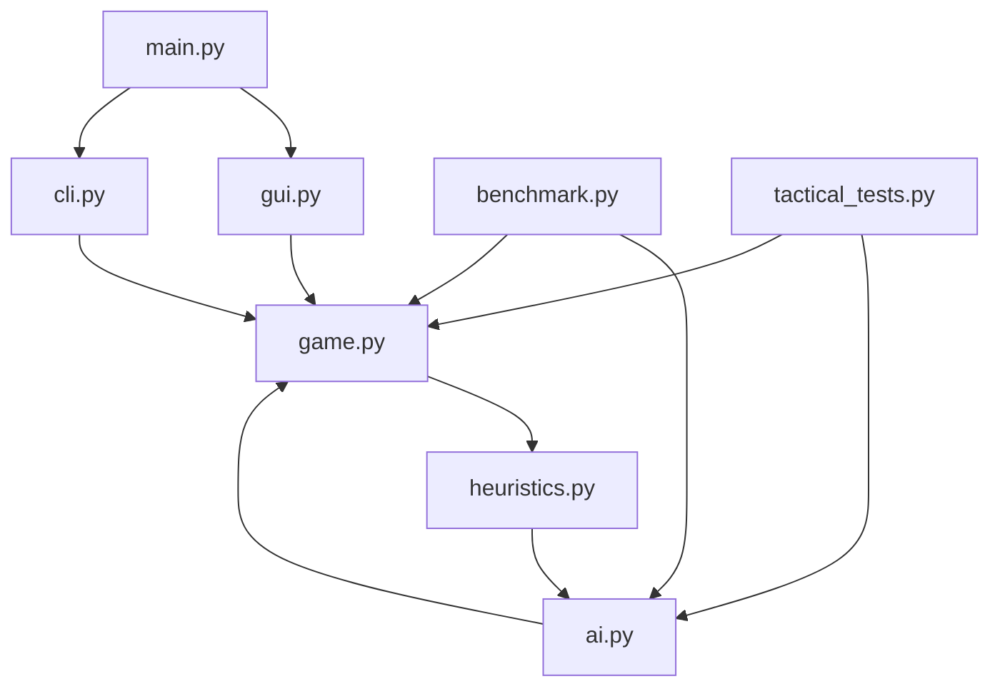
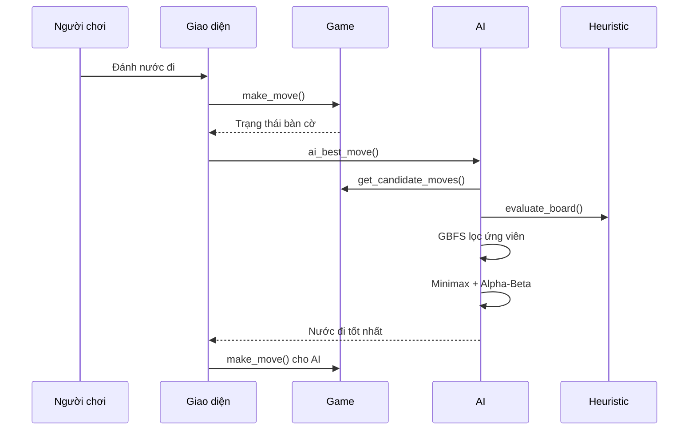
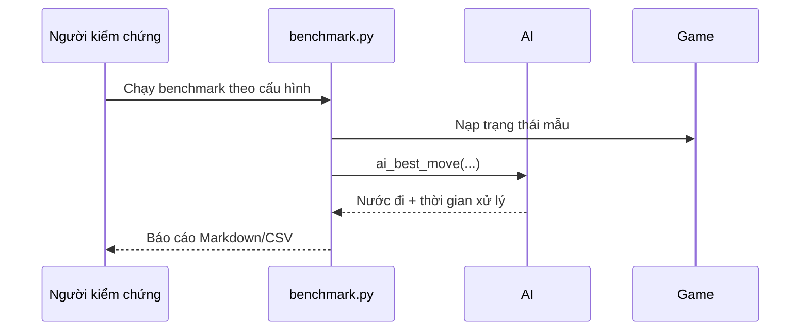
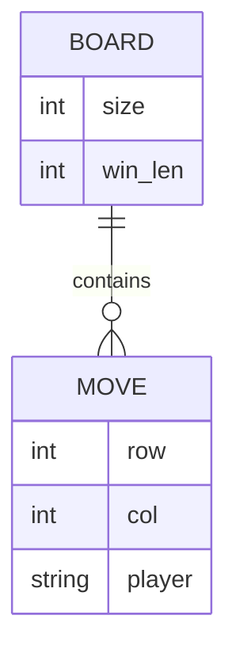

# Kiến Trúc Hệ Thống

## 1. Tổng quan hệ thống

Ứng dụng là trò chơi Cờ Caro cho phép người chơi đấu với AI. Luồng chính gồm giao diện đồ họa hoặc terminal, logic luật chơi, mô-đun đánh giá bàn cờ và mô-đun tìm kiếm nước đi. AI sử dụng GBFS để lọc ứng viên, rồi Minimax kết hợp Alpha-Beta để chọn nước đi chiến lược.

## 2. Công nghệ sử dụng

- Python 3
- `tkinter` cho giao diện đồ họa
- Chạy được ở chế độ CLI và GUI
- Thuật toán tìm kiếm: GBFS, Minimax, Alpha-Beta
- Heuristic đánh giá cục bộ bàn cờ
- Script benchmark hiệu năng xuất báo cáo Markdown/CSV
- Script kiểm thử chiến thuật cho các thế cờ bắt buộc

## 3. Cấu trúc thư mục

```text
Cocaro/
├─ ai.py
├─ benchmark.py
├─ cli.py
├─ constants.py
├─ game.py
├─ gui.py
├─ heuristics.py
├─ main.py
├─ tactical_tests.py
└─ docs/
    ├─ benchmarks/
    ├─ CHANGELOG.md
    └─ architecture.md
```

- `ai.py`: điều phối chọn nước đi cho AI.
- `game.py`: mô hình bàn cờ và luật thắng.
- `heuristics.py`: chấm điểm trạng thái bàn cờ.
- `gui.py`: giao diện trực quan và các mức độ khó.
- `cli.py`: giao diện dòng lệnh.
- `benchmark.py`: đo độ trễ AI theo nhiều cấu hình và trạng thái bàn cờ.
- `tactical_tests.py`: kiểm tra độ chính xác chiến thuật trong các tình huống bắt buộc.

## 4. Kiến trúc thành phần

- Tầng giao diện nhận tương tác từ người chơi.
- Tầng game xử lý hợp lệ nước đi, undo/redo và kiểm tra thắng.
- Tầng heuristic đánh giá giá trị của trạng thái hiện tại.
- Tầng AI dùng GBFS để sắp xếp và lọc ứng viên, sau đó gọi Minimax + Alpha-Beta để quyết định.
- Tầng kiểm chứng kỹ thuật gồm benchmark và tactical tests để xác nhận claim hiệu năng và chiến thuật.

## 5. Luồng dữ liệu

1. Người chơi nhập nước đi trên GUI hoặc CLI.
2. `game.py` kiểm tra tính hợp lệ và cập nhật bàn cờ.
3. Khi đến lượt AI, `ai.py` sinh các nước đi ứng viên gần vị trí đã đánh.
4. GBFS chấm điểm từng ứng viên bằng heuristic để giữ lại các nước hứa hẹn nhất.
5. Minimax + Alpha-Beta duyệt sâu trên tập ứng viên đã lọc.
6. Nước đi tốt nhất được trả về cho giao diện và cập nhật lên bàn cờ.
7. Khi cần nghiệm thu đề tài, `benchmark.py` và `tactical_tests.py` chạy độc lập để sinh bằng chứng định lượng.

## 6. Cơ chế bảo mật

Ứng dụng là game cục bộ nên không có xác thực người dùng hay mã hóa dữ liệu. Cơ chế an toàn chính là kiểm tra nước đi hợp lệ, tránh truy cập ngoài phạm vi bàn cờ và giới hạn thời gian tìm kiếm để không làm treo giao diện.

## 7. APIs / Routes cốt lõi

Ứng dụng không có API mạng. Các điểm vào và hàm lõi gồm:

- `main.py`: chọn chế độ GUI hoặc CLI.
- `gui.py`: điều khiển ván đấu bằng giao diện.
- `cli.py`: điều khiển ván đấu bằng terminal.
- `ai.py`: `ai_best_move`, `minimax`, `gbfs_rank_moves`.
- `game.py`: `make_move`, `undo_move`, `check_winner`, `get_candidate_moves`.
- `benchmark.py`: `run_profile`, `summarize`, `write_markdown`.
- `tactical_tests.py`: `run_case`, `main`.

## 8. Sơ đồ trực quan (Visual Diagrams - Mermaid.js)








