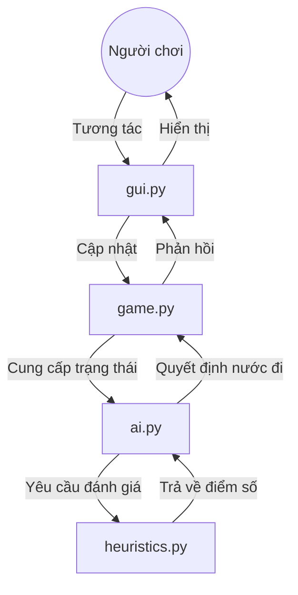
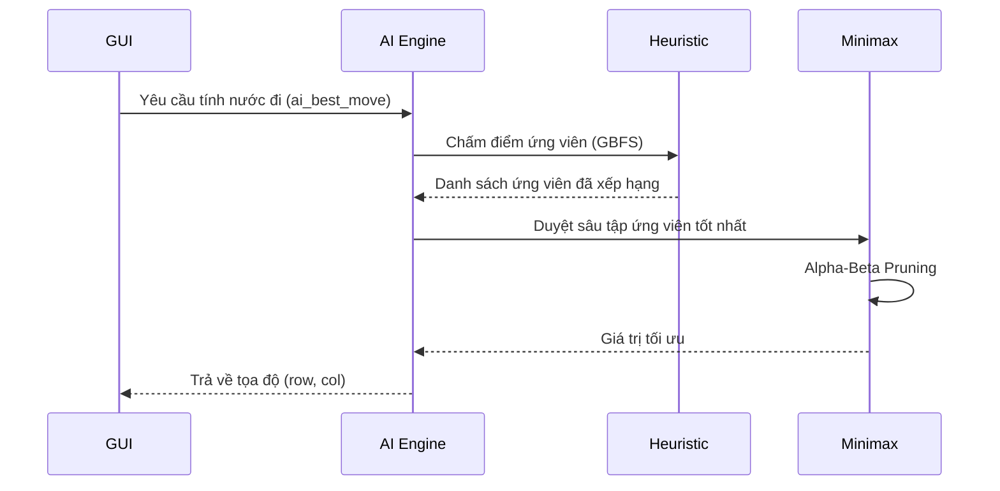
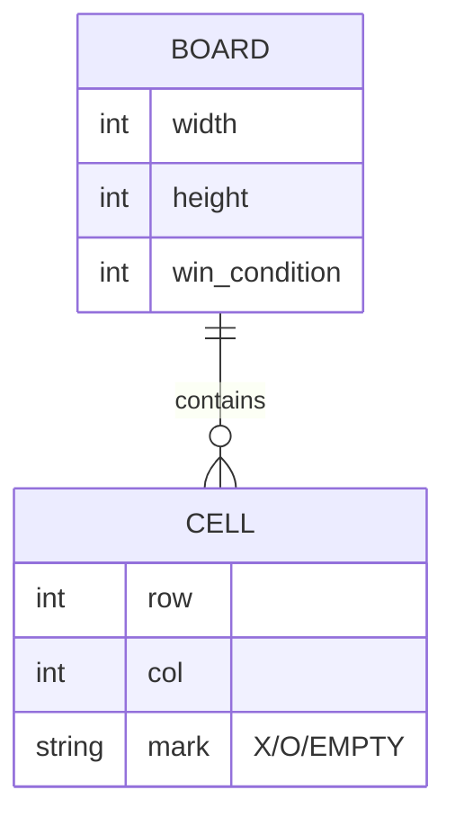

# Kiến Trúc Hệ Thống Cờ Caro AI

## 1. Tổng quan hệ thống (System Overview)
Dự án là một hệ thống trò chơi Cờ Caro tích hợp AI đối kháng. Mục tiêu cốt lõi là xây dựng một engine AI có khả năng xử lý trên các bàn cờ kích thước lớn mà vẫn đảm bảo độ trễ thấp (dưới 2 giây/lượt). Hệ thống kết hợp các thuật toán tìm kiếm cổ điển với kỹ thuật lọc ứng viên hiện đại để tối ưu hóa không gian trạng thái.

## 2. Công nghệ sử dụng (Tech Stack)
- **Ngôn ngữ lập trình**: Python 3.
- **Giao diện (GUI)**: Tkinter (Python Standard Library).
- **Thuật toán AI**: 
    - **GBFS (Greedy Best-First Search)**: Sàng lọc và sắp xếp các nước đi tiềm năng.
    - **Minimax**: Thuật toán ra quyết định đối kháng.
    - **Alpha-Beta Pruning**: Cắt tỉa các nhánh không triển vọng để tăng tốc độ duyệt.
- **Công cụ đo lường**: Custom Benchmark script (CSV/Markdown export).

## 3. Cấu trúc thư mục (Folder Structure)
```text
Cocaro/
├── main.py              # Điểm khởi đầu ứng dụng (Entry Point)
├── gui.py               # Xử lý giao diện người dùng và sự kiện đồ họa
├── game.py              # Logic cốt lõi: luật chơi, kiểm tra thắng/thua
├── ai.py                # Engine AI: Minimax, Alpha-Beta, GBFS
├── heuristics.py        # Hàm đánh giá trạng thái bàn cờ (Score calculation)
├── constants.py         # Quản lý hằng số hệ thống
├── tests/               # Thư mục kiểm thử và benchmark
│   ├── benchmark.py     # Công cụ đo lường hiệu năng AI
│   └── tactical_tests.py # Bộ kiểm thử các tình huống chiến thuật
└── docs/                # Thư mục tài liệu
    ├── architecture.md  # Tài liệu kiến trúc (File này)
    ├── CHANGELOG.md     # Nhật ký thay đổi
    └── benchmarks/      # Kết quả đo lường hiệu năng
```

## 4. Kiến trúc thành phần (Component Architecture)
Hệ thống được chia thành 3 lớp chính:
1. **Lớp Giao diện (Presentation Layer - `gui.py`)**: Nhận tương tác chuột, hiển thị bàn cờ và quản lý luồng hội thoại giữa người và máy.
2. **Lớp Logic (Business Logic Layer - `game.py`, `constants.py`)**: Điều phối luật chơi Caro, quản lý trạng thái bàn cờ và lịch sử nước đi.
3. **Lớp Trí tuệ nhân tạo (AI Engine Layer - `ai.py`, `heuristics.py`)**: Thành phần quan trọng nhất, thực hiện tính toán nước đi tối ưu dựa trên dữ liệu từ lớp Logic.

## 5. Luồng dữ liệu (Data Flow)
1. **Người chơi** thực hiện click trên lưới bàn cờ.
2. **`gui.py`** gửi yêu cầu kiểm tra tính hợp lệ đến **`game.py`**.
3. Nếu hợp lệ, bàn cờ cập nhật và gửi tín hiệu đến **`ai.py`** để yêu cầu AI phản hồi.
4. **`ai.py`** gọi `get_candidate_moves` từ **`game.py`** để lấy danh sách các ô trống xung quanh vùng đang đánh.
5. **`heuristics.py`** chấm điểm cục bộ cho từng ứng viên (GBFS).
6. Danh sách ứng viên tốt nhất được đưa vào **Minimax + Alpha-Beta** để tìm kiếm sâu hơn.
7. Nước đi tối ưu được trả về, **`gui.py`** vẽ quân cờ của AI lên màn hình.

## 6. Cơ chế hiệu năng và bảo mật (Performance & Security)
- **Search Pruning**: Kết hợp Alpha-Beta với GBFS cục bộ ở các tầng nông để tối đa hóa hiệu quả cắt tỉa mà không gây quá tải CPU ở các tầng sâu.
- **Incremental State**: Duy trì danh sách các ô đã đánh (`occupied_cells`) để sinh nước đi ứng viên nhanh chóng, tránh quét toàn bàn cờ.
- **Time Boxing**: AI được giới hạn thời gian tính toán (timeout) nghiêm ngặt nhờ cơ chế `deadline` kiểm tra liên tục ở mọi cấp độ đệ quy và sắp xếp.
- **Validation**: Kiểm tra nghiêm ngặt tính hợp lệ của nước đi (tránh ghi đè, đánh ngoài biên).

## 7. APIs / Routes cốt lõi (Core APIs/Routes)
Các hàm quan trọng điều phối toàn bộ hệ thống:
- `gui_main()`: Khởi chạy vòng lặp giao diện.
- `ai_best_move(board, depth, time_limit)`: Hàm chính để AI trả về nước đi tốt nhất.
- `evaluate_board(board, player)`: Tính toán điểm số chiến lược cho trạng thái hiện tại.
- `check_winner(board)`: Xác định ván đấu đã kết thúc hay chưa.

## 8. Sơ đồ trực quan (Visual Diagrams - Mermaid.js)

### Tổng quan kiến trúc

```mermaid
graph TD
    User((Người chơi)) -->|Tương tác| GUI[gui.py]
    GUI -->|Cập nhật| Game[game.py]
    Game -->|Cung cấp trạng thái| AI[ai.py]
    AI -->|Yêu cầu đánh giá| Heuristic[heuristics.py]
    Heuristic -->|Trả về điểm số| AI
    AI -->|Quyết định nước đi| Game
    Game -->|Phản hồi| GUI
    GUI -->|Hiển thị| User
```

### Luồng xử lý nước đi AI

```mermaid
sequenceDiagram
    participant G as GUI
    participant A as AI Engine
    participant H as Heuristic
    participant M as Minimax
    
    G->>A: Yêu cầu tính nước đi (ai_best_move)
    A->>H: Chấm điểm ứng viên (GBFS)
    H-->>A: Danh sách ứng viên đã xếp hạng
    A->>M: Duyệt sâu tập ứng viên tốt nhất
    M->>M: Alpha-Beta Pruning
    M-->>A: Giá trị tối ưu
    A-->>G: Trả về tọa độ (row, col)
```

### Mô hình dữ liệu bàn cờ

```mermaid
erDiagram
    BOARD ||--o{ CELL : contains
    BOARD {
        int width
        int height
        int win_condition
    }
    CELL {
        int row
        int col
        string mark "X/O/EMPTY"
    }
```
